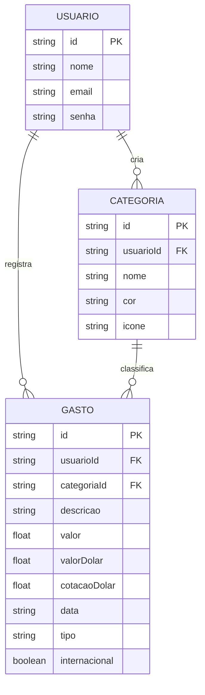

# 🛠️ Especificação Técnica (Tech Spec) - Wallet Friend

Este documento detalha a arquitetura técnica, o modelo de dados e os contratos de API (via JSON Server) necessários para o funcionamento do sistema de controle de gastos Wallet Friend.

---

## 1. Modelo de Dados (Diagrama ER)

Abaixo está o Diagrama Entidade-Relacionamento (DER) que representa a estrutura do nosso "banco de dados" (`db.json`) e como as informações se conectam.



---

## 2. Dicionário de Dados

Breve explicação das tabelas principais:

* **Usuários:** Armazena os dados de autenticação do usuário na aplicação.
  * `id`: Identificador único gerado pelo JSON Server (String).
  * `nome`: Nome completo do usuário.
  * `email`: Chave de acesso do usuário. Validado via REGEX no front-end para garantir formato correto.
  * `senha`: Senha de acesso. Em um cenário real seria criptografada, mas para o MVP é armazenada em texto simples.

* **Categorias:** Armazena as categorias de gastos criadas pelo próprio usuário para organizar suas despesas.
  * `id`: Identificador único gerado pelo JSON Server (String).
  * `usuarioId`: Chave estrangeira que vincula a categoria ao usuário que a criou.
  * `nome`: Nome da categoria (ex: "Alimentação", "Lazer", "Transporte").
  * `cor`: Código HEX da cor associada à categoria, utilizada nos gráficos do dashboard.
  * `icone`: Classe ou nome do ícone associado à categoria para exibição visual.

* **Gastos:** Registra todos os gastos lançados pelo usuário. É a entidade central da aplicação.
  * `id`: Identificador único gerado pelo JSON Server (String).
  * `usuarioId`: Chave estrangeira que vincula o gasto ao usuário (padrão de nomenclatura exigido pelo JSON Server para rotas aninhadas).
  * `categoriaId`: Chave estrangeira que vincula o gasto a uma categoria.
  * `descricao`: Texto livre descrevendo o gasto (ex: "Almoço no restaurante").
  * `valor`: Sempre um número positivo (Float). Representa o valor da despesa.
  * `data`: Data em que o gasto foi realizado, no formato `YYYY-MM-DD`.
  * `tipo`: Aceita apenas os valores `"FIXO"` ou `"VARIAVEL"`, permitindo análises de padrão de consumo.
  * `internacional`: Boolean que indica se o gasto foi uma compra internacional (em dólar).
  * `valorDolar`: Valor original da compra em dólar (Float). Preenchido apenas quando `internacional` for `true`.
  * `cotacaoDolar`: Cotação do dólar no momento do registro, obtida via AwesomeAPI. Armazenada para fins de histórico.

---

## 3. API Pública (AwesomeAPI - Cotação do Dólar)

A aplicação consome a API pública da AwesomeAPI para obter a cotação do dólar em tempo real no momento do registro de compras internacionais.

- **Endpoint:** `GET https://economia.awesomeapi.com.br/last/USD-BRL`
- **Uso:** Chamada realizada quando o usuário marca um gasto como internacional. O valor retornado em `bid` (preço de compra) é usado para converter o valor em dólar para reais, e ambos são salvos no gasto.
- **Tratamento de erro:** Caso a API esteja indisponível, o usuário é notificado e pode inserir a cotação manualmente.

---

## 4. Rotas da API (JSON Server)

A aplicação consome a API local simulada pelo JSON Server. Abaixo os principais endpoints:

* `POST /usuarios` - Cadastra um novo usuário.
* `GET /usuarios?email=x&senha=y` - Autentica um usuário pelo e-mail e senha.
* `GET /categorias?usuarioId=1` - Retorna todas as categorias de um usuário específico.
* `POST /categorias` - Cadastra uma nova categoria.
* `DELETE /categorias/:id` - Remove uma categoria.
* `GET /gastos?usuarioId=1` - Retorna todos os gastos de um usuário específico.
* `GET /gastos?usuarioId=1&categoriaId=2` - Retorna gastos filtrados por categoria.
* `POST /gastos` - Registra um novo gasto.
* `DELETE /gastos/:id` - Remove um gasto.

---

## 4. Estrutura do Banco de Dados (db.json)

Esta é a representação em formato JSON do banco de dados simulado. Esta estrutura serve de contexto para ferramentas de IA e para o JSON Server inicializar a API Fake.

```json
{
  "usuarios": [
    {
      "id": "1",
      "nome": "Maria Souza",
      "email": "maria@email.com",
      "senha": "senha123"
    }
  ],
  "categorias": [
    {
      "id": "1",
      "usuarioId": "1",
      "nome": "Alimentação",
      "cor": "#FF6384",
      "icone": "fa-utensils"
    },
    {
      "id": "2",
      "usuarioId": "1",
      "nome": "Transporte",
      "cor": "#36A2EB",
      "icone": "fa-car"
    },
    {
      "id": "3",
      "usuarioId": "1",
      "nome": "Lazer",
      "cor": "#FFCE56",
      "icone": "fa-gamepad"
    }
  ],
  "gastos": [
    {
      "id": "1",
      "usuarioId": "1",
      "categoriaId": "1",
      "descricao": "Almoço no restaurante",
      "valor": 35.90,
      "data": "2026-03-10",
      "tipo": "VARIAVEL"
    },
    {
      "id": "2",
      "usuarioId": "1",
      "categoriaId": "2",
      "descricao": "Gasolina",
      "valor": 150.00,
      "data": "2026-03-12",
      "tipo": "VARIAVEL"
    },
    {
      "id": "3",
      "usuarioId": "1",
      "categoriaId": "3",
      "descricao": "Assinatura Netflix",
      "valor": 55.90,
      "data": "2026-03-15",
      "tipo": "FIXO"
    }
  ]
}
```